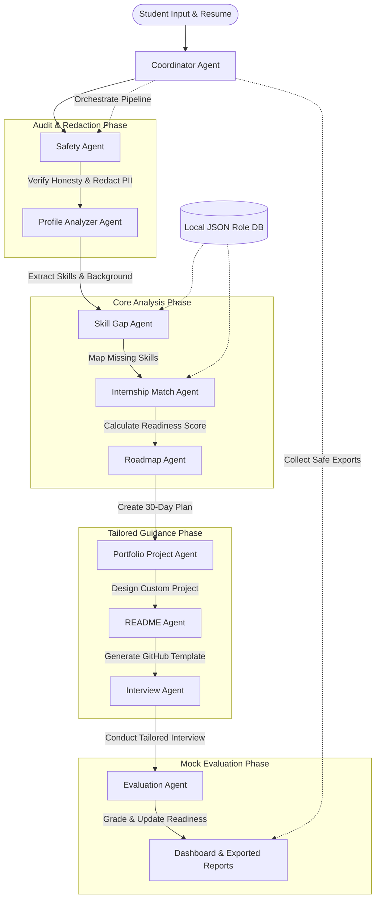

# SkillBridge AI: Multi-Agent Internship Readiness Coach & Portfolio Builder

SkillBridge AI is a state-of-the-art multi-agent career coaching platform designed specifically for college students and career transitioners seeking their first technical internships. Developed as a portfolio-ready capstone project for the **Kaggle AI Agents Intensive Vibe Coding Hackathon**, it leverages a choreographed multi-agent pipeline and an MCP-style tool layer to analyze candidate profiles, map capability gaps, generate tailored study plans, design custom portfolio projects, and run real-time interactive mock interviews.

---

## 📌 Project Overview

### Problem Statement
College students seeking tech internships face a frustrating **"cold-start"** problem:
1. **The Skill Gap Paradox:** They do not know which specific industrial skills (e.g., FastAPI, Docker, Pytest) are missing from their academic background (e.g., basic Python/Java).
2. **Generic Portfolios:** They build generic projects (e.g., simple calculators or house-price predictions) that fail to impress recruiters.
3. **Ineffective Documentation:** Their GitHub repositories lack professional documentation, such as clean READMEs and setup guidelines.
4. **Interview Anxiety:** They struggle with mock interviews because they do not receive feedback tailored to their target role and actual skill gaps.

### Target Users
* **Computer Science and Data Science Undergraduates** looking for their first technical internships.
* **Bootcamp Graduates and Self-Taught Developers** transitioning into industry.
* **Career Mentors and Educators** looking for scalable coaching frameworks.

### Why AI Agents are Needed
A single linear prompt to an LLM cannot solve this complex task. Bridging the readiness gap requires a multi-step workflow where information is analyzed, cross-referenced with target databases, verified for safety, and generated iteratively. AI Agents are needed to:
* **Enforce Separation of Concerns:** A `Safety Agent` shouldn't worry about mock interview grading, and a `Roadmap Agent` shouldn't worry about skill parsing.
* **Integrate Deterministic Tools:** Agents query local role-requirement databases and compute math scores using dedicated tools.
* **Maintain Pipeline Continuity:** A `Coordinator Agent` manages shared state, ensuring that the roadmap and mock interviews are directly informed by the specific gaps identified during profile analysis.

---

## 🌐 Solution & Multi-Agent Architecture

SkillBridge AI operates using a **choreographed multi-agent pipeline**. Rather than a central controller micro-managing every step, the `Coordinator Agent` invokes specialized agents in sequence, passing the cumulative state forward.

### 📐 Mermaid Architecture Diagram



### 🤖 Agent Responsibilities

| Agent Name | Primary Goal | Input Data | Output Generated | Tool Usage |
| :--- | :--- | :--- | :--- | :--- |
| **Coordinator** | Orchestrates pipeline state & triggers | Raw Student Profile dict | Coordinated state report | `list_available_roles` |
| **Safety** | Audits profile honesty & redacts PII | Raw resume / text inputs | Masked profile, flags, score | `detect_fake_claim_request`, `honesty_check`, `redact_sensitive_info`, `validate_no_api_keys` |
| **Profile Analyzer**| Extracts structured candidate details | Redacted profile text | Name, education, skills list | `normalize_skills` |
| **Skill Gap** | Identifies missing core technologies | Candidate skills, target role | Strengths, gaps, required list | `get_role_requirements`, `match_skills_to_role` |
| **Internship Match**| Rates candidate fit for target roles | Skills matched, role reqs | Match %, fit category | `calculate_readiness_score` |
| **Roadmap** | Plans day-by-day learning schedules | Skill gaps, study hours | Week-by-week 30-day plan | `create_30_day_plan` |
| **Portfolio Project**| Designs a high-impact, custom project | Skill gaps, target role | Project name, stack, milestones| Internal builder |
| **README** | Drafts repository-ready documentation | Project milestones & stack | Markdown GitHub README file | `generate_project_readme` |
| **Interview** | Serves targeted mock questions | Skill gaps, target role | Technical mock questions | Internal builder |
| **Evaluation** | Grades student answers & updates score | Mock responses & questions | Evaluation grade & feedback | `calculate_category_scores` |

---

## 🛠️ MCP-Style Tool Layer Explanation

SkillBridge AI features a decoupled, **Model Context Protocol (MCP) style tool layer** (`tools/mcp_server.py`). The registry manages available system tools, exposes schemas to agents, and allows agents to invoke functions dynamically.

* **Decoupled Architecture:** All computational and data-access logic (scoring, database reads, PII masking, file exports) is implemented as pure Python functions. They are registered inside the `MCPToolRegistry`.
* **Standard Schemas:** Every tool specifies a JSON-schema defining its input parameters.
* **External Integration Support:** The tool layer includes native support for the **FastMCP SDK**. When the `mcp` package is available, it exposes the system tools as an standard external MCP server, allowing integrations into developer tools (e.g., Claude Desktop, Cursor, or the Antigravity IDE).

---

## 💻 Tech Stack

* **Frontend Dashboard:** [Streamlit](https://streamlit.io/) (utilizing custom CSS injections, glassmorphism UI, Outfit/Plus Jakarta fonts, and sidebar interactive widgets).
* **Multi-Agent Orchestration:** Pure Python state pattern with choreographed agent modules.
* **LLM Core / LLM Client:** Google Gemini API (`google-generativeai` package) with robust connection retry logic.
* **Database:** Local JSON role matching schema (`data/role_requirements.json`) featuring industry standard internship skill matrix maps.
* **Test Suite:** [Pytest](https://docs.pytest.org/) verifying scoring rules, PII redaction, mock exports, and agent modules.

---

## 🌟 Wow Feature: Internship Readiness Score

The **Internship Readiness Score** is a dynamic, mathematically grounded index representing a student's preparedness for their target role:

$$\text{Readiness Index} = (\text{Match \%} \times 0.6) + (\text{Mock Interview Grade} \times 0.4)$$

* **Match Percentage (60% weight):** Calculated by cross-referencing candidate skills against required technologies in the local JSON database:
  $$\text{Match \%} = \frac{|\text{Extracted Skills} \cap \text{Required Skills}|}{|\text{Required Skills}|}$$
* **Mock Interview Grade (40% weight):** A dynamic component updated when a student participates in the mock interview. The `Evaluation Agent` assesses the answers, scores them out of 100, and adjusts the general index.
* **Visual Presentation:** Displayed in the Streamlit UI using vibrant color-coded metrics (High Readiness, Moderate Readiness, Need Preparation) with custom diagnostic sub-metrics.

---

## 🔒 Security & Privacy Features

SkillBridge AI is designed with strict security controls to be fully enterprise and judge-ready:

* **Strict Key Isolation:** Read `GOOGLE_API_KEY` only from local `.env`. The key is never read from general system environment variables, preventing leakage.
* **Ignore Configurations:** `.env` is listed in `.gitignore`. The repository only commits `.env.example` containing:
  ```
  GOOGLE_API_KEY=your_gemini_api_key_here
  ```
* **No Hardcoded Credentials:** The repository is scanned and completely free of any real credentials or passwords.
* **PII & Secret Redaction:** Resume and profile text are passed through the Safety Agent before any LLM processing. It automatically masks:
  * **Emails:** Replaced with `[REDACTED_EMAIL]`.
  * **Phone Numbers:** Replaced with `[REDACTED_PHONE]`.
  * **API Keys/Secrets:** Matches common regexes (`API_KEY=`, `password=`, `secret=`, `sk-`, and high-entropy 32+ character tokens) and replaces them with `[REDACTED_SECRET]`.
* **Honesty Check & Fake Claim Prevention:** Detects requests to insert fake experiences or certifications (e.g., *"Add that I worked at Google even though I didn't"*, *"Create fake internship experience"*, *"Lie in my resume"*). If detected, it overrides the request and outputs:
  > **"I can't help add fake experience or false claims. I can help you describe your real projects and skills more professionally."**
* **Safe Exports:** The export functions in `tools/export_tools.py` run the redaction engine over all reports before writing them to Markdown or JSON, ensuring exported files are secure.

---

## 🔄 Gemini Fallback Mode

SkillBridge AI works **fully and robustly even without a Gemini API key**:
* **No-Key Safe Mode:** If `GOOGLE_API_KEY` is missing from `.env` or invalid, the app enters **Safe Fallback Mode**. The sidebar updates to display:
  `⚠️ Running in safe fallback mode (No API Key)`
* **Deterministic Fallbacks:** The pipeline switches to local rule-based generation (using templates and standard gap databases) for the roadmap, portfolio specifications, and mock interview questions.
* **Graceful API Handling:** All LLM calls catch API key errors, quota limits, and network dropouts gracefully. The app **never crashes**, allowing seamless local testing and deployment.

---

## 🤖 Development Collaboration: Antigravity IDE Agent

SkillBridge AI was developed in collaboration with **Antigravity**, Google DeepMind's agentic coding assistant:
* **Orchestration Execution:** Antigravity was used to implement the choreographed agents and build the local tools registry.
* **Security Hardening:** Antigravity designed the multi-regex safety sanitizers, integrated the PII redaction layer, and modified the Streamlit interface to display safety flags.
* **Test Scaffolding:** Antigravity developed the full 59-test suite covering edge cases, fake claims, local database scoring, and markdown exports, securing 100% pass rates.

---

## 🚀 Setup & Execution Instructions

### 1. Clone the Repository
Open a terminal in your workspace directory:
```bash
git clone <repository_url>
cd skillbridge-ai-agent
```

### 2. Set up a Virtual Environment
```bash
python -m venv venv

# On Windows:
.\venv\Scripts\activate

# On macOS/Linux:
source venv/bin/activate
```

### 3. Install Dependencies
```bash
pip install -r requirements.txt
```

### 4. Configure Environment Variables
Copy the example environment file:
```bash
cp .env.example .env
```
Open `.env` and enter your Gemini API key (optional — the app will run in fallback mode if left empty):
```env
GOOGLE_API_KEY=AIzaSy...your_actual_key...
```

---

## 🏃 How to Run the App

### Running the Dashboard Locally
Start the Streamlit application:
```bash
streamlit run app.py
```
Open your browser to `http://localhost:8501`.

### Running Tests
Execute the full pytest suite to verify correctness:
```bash
pytest -v
```

---

## ☁️ How to Deploy on Streamlit Cloud

1. Push your repository to your GitHub account (ensure `.env` is **not** committed).
2. Go to [Streamlit Share](https://share.streamlit.io/) and click **New app**.
3. Select your repository, branch (`main`), and set the main file path to `app.py`.
4. Click **Advanced settings** and paste your environment keys into the **Secrets** section:
   ```toml
   GOOGLE_API_KEY = "your_actual_gemini_api_key"
   ```
5. Click **Deploy**.

---

## 📈 Demo Input & Sample Output

### Example Input
1. **Target Internship Role:** `AI/ML Intern`
2. **Existing Core Skills:** `Python, NumPy, basic ML, LeetCode`
3. **Uploaded Profile / Text Input:**
   ```text
   Alex Mercer
   Email: alex.mercer@gmail.com
   Phone: +1-555-0199
   Education: 2nd year AI & DS student
   Projects: Basic house price prediction in Python.
   Study Available: 2 hours/day
   ```

### Generated Dashboard Report
* **Safety Review Panel:** Flags email and phone, showing redacted output (`[REDACTED_EMAIL]` and `[REDACTED_PHONE]`).
* **Internship Readiness score:** Calculates basic readiness (e.g., 65%).
* **Gap Analysis:** Flags missing skills: `Pandas`, `Scikit-Learn`, `Git`, `Model Deployment`, `FastAPI`.
* **Roadmap:** Sets up a week-by-week schedule covering Scikit-Learn validation, Pandas workflows, and deployment basics.
* **Portfolio Project:** Suggests building a *House Price API* containerized using Docker and served via FastAPI.
* **Mock Interview:** Asks target ML questions (e.g., explaining bias-variance tradeoff or LeetCode algorithmic constraints).

---

## 📸 Screenshots Placeholder
*Once deployed, insert screenshots of your dashboard tabs here:*
* *Overview Dashboard:* ``
* *Safety Diagnostics:* ``
* *Gap Mapping:* ``
* *Roadmap Plan:* ``

---

## 🏆 Kaggle Submission Notes
* **Project Name:** SkillBridge AI
* **Intensive Vibe Coding Track:** Agentic UI & Multi-Agent Choreography.
* **Key Innovation:** Bringing secure PII masking and fake claim prevention to student career guidance, backed by an MCP-compliant registry layer.

---

## 🔮 Future Improvements
* **Live Job Postings Integration:** Connecting the Skill Gap Agent to external APIs (e.g., LinkedIn or Indeed) to parse live internship descriptions.
* **GitHub Actions Integration:** Auto-committing the generated README template to a student's GitHub repository.
* **Voice Mock Interview:** Adding WebRTC voice support for real-time speech-to-text mock interviews.
