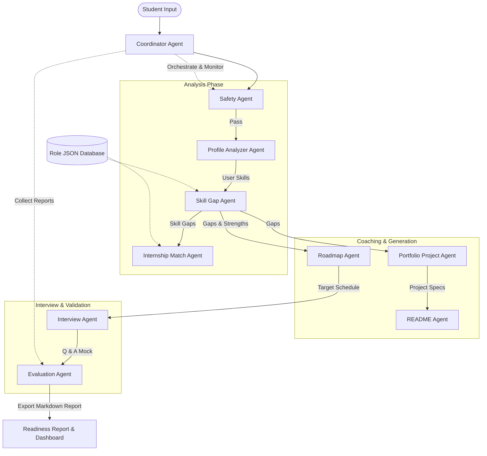

# System Architecture: SkillBridge AI

SkillBridge AI is a multi-agent system built using a choreographed pipeline pattern. The Coordinator Agent directs the execution of individual specialized agents that utilize local requirements databases and LLMs to perform analysis, scoring, generation, safety checks, and evaluation.

## Agent Architecture Diagram

Below is the design layout showing how agents pass data throughout the coaching process.

## Agent Responsibilities

1. **Coordinator Agent**: Oversees and monitors the entire multi-agent process, handling stage transitions, shared state management, and logging.
2. **Safety Agent**: Audits input resumes to filter toxic keywords and masks PII data (phone numbers, email addresses).
3. **Profile Analyzer Agent**: Parses raw resume text to extract education, previous project structures, and stated skills.
4. **Skill Gap Agent**: Cross-references the extracted profile skills against standard role listings inside `data/role_requirements.json` to count strengths and weaknesses.
5. **Internship Match Agent**: Calculates compatibility percentages representing the match quality for target internship postings.
6. **Roadmap Agent**: Designs a structured 30-day day-by-day learning plan.
7. **Portfolio Project Agent**: Specifies tailored repository projects matching the student's gaps.
8. **README Agent**: Generates custom markdown README templates that students can publish in their project directories.
9. **Interview Agent**: Serves mock questions addressing skill gaps.
10. **Evaluation Agent**: Analyzes student mock responses to update readiness status.
