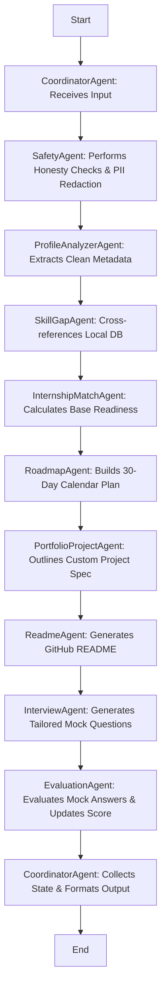

# Technical Architecture Design: SkillBridge AI

SkillBridge AI is a robust multi-agent system built using a **choreographed pipeline pattern** and a decoupled, **Model Context Protocol (MCP) style tool layer**. It is designed to coach college students and career transitioners toward internship readiness in software development, data science, and AI/ML.

---

## 1. System Overview

The system consists of three primary tiers:
1. **Interactive User Interface (Agentic UI):** Built with Streamlit, exposing real-time status indicators, interactive career configuration selectors, and comprehensive safety review logs.
2. **Multi-Agent Choreography Engine:** A sequence of 10 specialized agent classes. Each agent manages its own prompt construction, queries the tool layer, and passes structured outcomes to the shared state dictionary.
3. **MCP-Style Tool Layer:** A central registry (`MCPToolRegistry`) that abstracts all functional tasks (such as database queries, math evaluations, safety checks, and report formatting) from LLM generation.

---

## 2. Multi-Agent Workflow

Rather than using an orchestrator that actively prompts and decides subsequent actions dynamically at each step (which increases LLM token usage and latency), SkillBridge AI implements a **choreographed state pipeline**.

### Workflow Order



### Coordinator Agent Role
The `CoordinatorAgent` controls the execution pipeline:
* **State Management:** Passes a mutable `student_state` dictionary from agent to agent.
* **Resilience & Fallback:** Inspects if the Gemini API key is configured. If not, it configures agents to operate in deterministic safe fallback mode.
* **Output Gathering:** Consolidates reports from all agents and returns a unified structure.

---

## 3. Data Flow: User Input to Final Report

```
[Student Name, Target Role, Skills, Resume text]
                     │
                     ▼
             [SafetyAgent]
                     │
        ┌────────────┴────────────┐
        ▼                         ▼
 [Detect Fake Claims]     [Mask PII & Secrets]
        │                         │
        └────────────┬────────────┘
                     ▼
           [ProfileAnalyzerAgent]  ──► (Extracts name, education, skills list)
                     │
                     ▼
              [SkillGapAgent]      ◄── (Queries data/role_requirements.json)
                     │
                     ▼
           [InternshipMatchAgent]  ──► (Calculates match % based on DB overlap)
                     │
                     ▼
               [RoadmapAgent]      ──► (Generates week-by-week prep task schedules)
                     │
                     ▼
          [PortfolioProjectAgent]  ──► (Outlines custom high-impact GitHub projects)
                     │
                     ▼
               [ReadmeAgent]       ──► (Drafts a professional README.md template)
                     │
                     ▼
             [InterviewAgent]      ──► (Exposes skill-specific mock questions)
                     │
                     ▼
             [EvaluationAgent]     ──► (Grades answers & computes final Readiness Score)
                     │
                     ▼
            [Export/Save Report]   ◄── (Applies redact_sensitive_info to export files)
```

---

## 4. MCP-Style Tool Layer Explanation

To keep agents lightweight, predictable, and testable, all core computations are isolated into a **Model Context Protocol (MCP) style registry** in `tools/mcp_server.py`.

### The Tool Registry (`MCPToolRegistry`)
* **Dynamic Registration:** Functions from tools modules (e.g., `matching_tools.py`, `scoring_tools.py`, `safety_tools.py`) are registered on startup using JSON schemas.
* **Dynamic Invocation:** Agents query tools using `execute_tool(name, **kwargs)`.
* **Testing isolation:** Individual tools are fully unit-tested in isolation without mocking LLM behavior.

### External FastMCP Support
The registry incorporates the native **FastMCP** SDK wrapper:
```python
try:
    from mcp.server.fastmcp import FastMCP
    mcp = FastMCP("SkillBridgeAI")
    
    @mcp.tool()
    def check_safety(text: str) -> str:
        # Exposes the safety engine as an MCP tool
        ...
except ImportError:
    mcp = None
```
This allows SkillBridge AI to run as a standard external MCP server, integrating directly with IDEs (Cursor, VSCode) or client applications (Claude Desktop) to serve career coaching capabilities.

---

## 5. Security & Privacy Layer

Security is embedded directly at the boundaries of the pipeline to guarantee profile privacy and data honesty:

### Pipeline Ingress (Safety Agent)
* **Honesty Check:** Runs regex sanitization for fake claim keywords (e.g., `"fake experience"`, `"fake certificate"`). If present, it sets flags, drops the integrity score, and injects honest learning alternatives.
* **PII Masking:** Email patterns and telephone number patterns are mapped and scrubbed.
* **Credential Protection:** Scans for high-entropy strings (32+ alphanumeric chars) and specific key definitions (e.g., `GOOGLE_API_KEY=`, `API_KEY=`, `password=`, `sk-`).

### Pipeline Egress (Export Redactor)
* The JSON and Markdown report export modules (`tools/export_tools.py`) automatically pass final reports through the `redact_sensitive_info` sanitizer.
* This guarantees that even if a student accidentally typed their password or API key into a dashboard field, it is redacted from the final files saved to disk.
